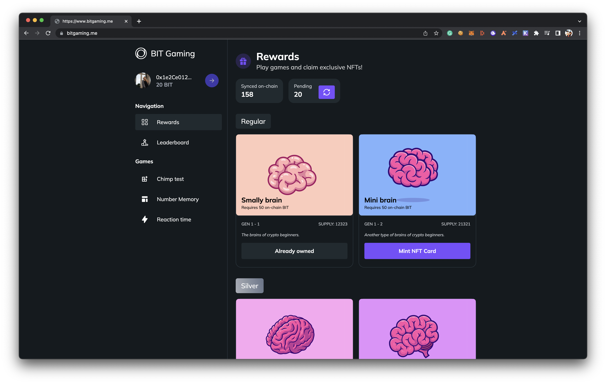

<p align="center">
  <a href="http://laddy.app">
    
  </a>
</p>

<h1 align="center">Bit Gaming</h1>

<h3 align="center">
  Samruk Hackathon Winner 🏆
</h3>

<p align="center">Play-to-earn DAO with exclusive NFT collection</p>



### Idea

We are bringing together curious minds and reward them with our own ERC20 tokens and exclusive NFTs.

### Competitive

Leaderboard allows you to compete with our DAO members.

### Extendable

Unlimited possibilites with potential to add new gaming experience.

## Smart contracts

Our core smart contracts are verified on Goerli testnet.

| Contract                                  | Link                                  |
| ---------------------------------------- | -------------------------------------------- |
| `BIT ERC20 Token` | [0x2C04c3Faf3040eA42A6887eC230Cf0a397eb28a2](https://goerli.etherscan.io/address/0x032b33471C9EF4E88844D846C22E9423fEB99155#code) |
| `Brain ERC721 NFT` | [0xB94DDe6743f073de10943665302b3493e464aa02](https://goerli.etherscan.io/address/0xf300cA633C836bB98d5efD063a5C34e13cDAc6Cc#code) |

## Setup

### Install

```bash
git clone https://github.com/ironsoul0/bitgaming.me
cd bitgaming.me
yarn
```

### Run

Run local `hardhat` chain for deploying smart contracts.

```bash
yarn chain
```

Deploy smart contracts to local chain.

```bash
yarn deploy
```

Run frontend for interacting with the application.

```bash
yarn dev
```

## Notes

- This project was created for participating in [JAS Ventures Hackathon Blockchain day](https://jva.vc/index.php/ru/hackathon)
- Developed by [@Akezh](https://github.com/Akezh) and [@ironsoul0](https://github.com/ironsoul0)

## License

This project is open source and available under the [MIT License](LICENSE).